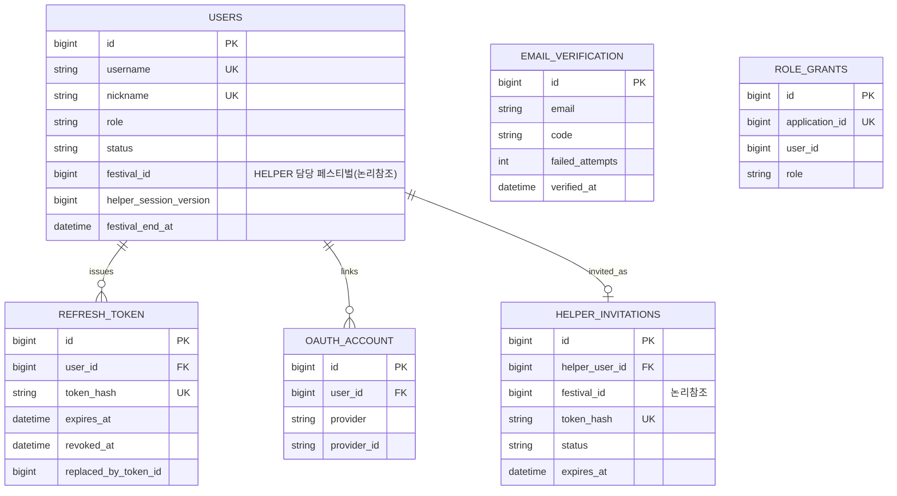
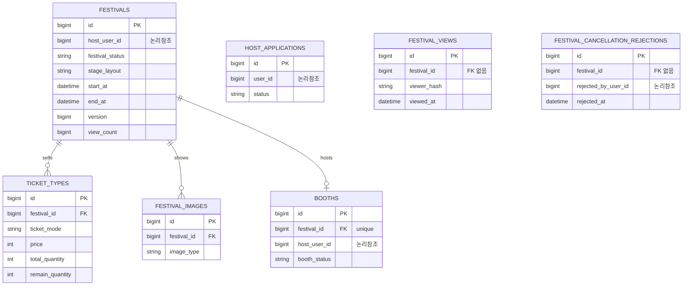
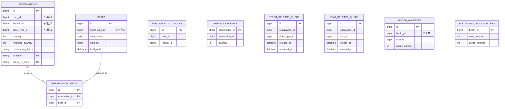
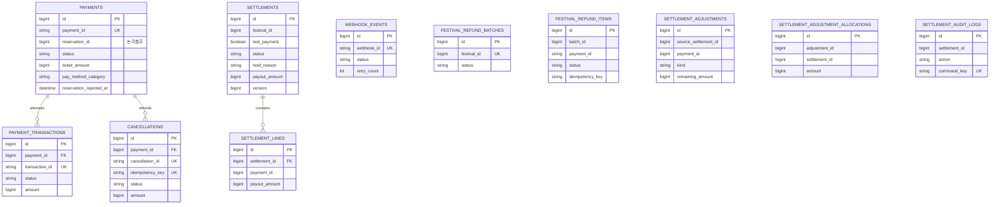

# ERD
<aside>
🗂️

Service별 Table·핵심 Column·불변식/상태를 정의합니다. FK는 같은 Service DB 안에서만 사용하고, 다른 Service ID는 논리 참조입니다.

</aside>

관련 업무 규칙: 요구사항 문서 - 4. 업무 규칙 · 데이터 소유권: 서비스 경계 문서 - 데이터 소유권

> 기준일 2026-09-28(main 코드) — 실행 원본은 각 서비스의 JPA 엔티티(ddl-auto: update)이며 Migration 파일은 없습니다. DB는 core-db 단일 MySQL 인스턴스에 auth_db·festival_db·reservation_db·payment_db 4개 스키마로 운영됩니다. 엔티티 수: auth 6, festival 7, reservation 9, payment 11(총 33, auth에는 컬렉션 테이블 helper_invitation_sends가 추가로 있음).
> 

## Service별 모델

| Service | Table·Aggregate | 핵심 Column | 불변식·상태 | 관련 Story·계약·Test | 상태 |
| --- | --- | --- | --- | --- | --- |
| auth-service (A) | User (users) | id, name, username(email, unique), password(OAuth 전용·활성화 전 도우미는 null), nickname(unique), `role`(`USER`/`HOST`/`HELPER`/`ADMIN`/`STOREHOST`, 기본 USER), `status`(`PENDING_ACTIVATION`/`REVOKED`/`ACTIVE`/`SUSPENDED`/`WITHDRAWN`, 기본 ACTIVE), created_at, updated_at, withdrawn_at, suspend_reason, suspended_at, terms_agree_at, failed_login_attempts, locked_until, password_changed_at, festival_id(HELPER 전용, 담당 페스티벌 논리참조), helper_session_version(HELPER 세션 버전), festival_end_at(HELPER 전용 스냅샷) | role은 User 컬럼 하나로 저장(별도 Role 테이블 없음). HELPER는 셀프 가입 불가 — 호스트의 도우미 발급 API로만 PENDING_ACTIVATION으로 생성되고 festival_id가 정확히 하나 배정됨, 초대 수락 시 ACTIVE, 해지 시 REVOKED이며 활성화·해지 때 helper_session_version이 올라 이전 세션을 거부. 로그인 5회 실패 시 locked_until(10분)까지 잠금. 일반 회원 탈퇴는 행을 남기고 이름·닉네임·username을 익명 값으로 바꾸며 소셜 연동 행은 삭제. HELPER는 festival_end_at + 24시간(HELPER_ACCOUNT_REVOKE_AFTER_HOURS) 뒤 배치가 초대·refresh 토큰·계정을 물리 삭제. | Story #8(회원가입), 도우미 계정 발급 · UserAuthAcceptanceTest, HelperAccountServiceTest, UserServiceTest | IMPLEMENTED |
| auth-service (A) | RefreshToken (refresh_token) | id, user_id(FK→users), token_hash(unique, SHA-256 해시), helper_session_version(발급 시 복사), expires_at, revoked_at, replaced_by_token_id, created_at | 평문 토큰은 저장하지 않고 해시만 저장. 재발급 시 기존 토큰은 revoked_at을 기록하고 replaced_by_token_id로 새 토큰과 연결(Rotation). 폐기 후 5초 안의 재사용은 체인을 따라 최신 토큰으로 교체하고, 그 뒤의 재사용이 감지되면 해당 유저의 모든 토큰을 폐기. | 로그인·재발급·로그아웃 · UserAuthAcceptanceTest | IMPLEMENTED |
| auth-service (A) | EmailVerification (email_verification) | id, email, code(6자리), expires_at, verified, failed_attempts, verified_at, verification_token_hash(64), created_at | 회원가입·비밀번호 재설정 전 이메일 인증 확인용. 코드 유효 5분, 오답 5회면 잠금. AuthService가 signup·비밀번호 재설정 시 인증 완료를 강제하며(미인증이면 400 EMAIL_NOT_VERIFIED), 확인에 성공하면 해당 인증 행을 삭제해 재사용을 막는다(1회용). 비밀번호 재설정은 인증 성공 때 발급한 토큰의 해시가 일치하고 인증 후 10분 이내일 때만 허용. 발송은 재발송 쿨다운 30초, 10분당 5회로 제한한다 | 이메일 인증(회원가입·비밀번호 재설정 화면) · EmailVerificationServiceTest, PasswordResetAcceptanceTest | IMPLEMENTED |
| auth-service (A) | OauthAccount (oauth_account) | id, user_id(FK→users), provider(KAKAO·GOOGLE 문자열), provider_id, linked_at | unique(provider, provider_id) — 같은 소셜 계정은 한 회원에만 연결. 회원 탈퇴 시 삭제. | GET /api/auth/kakao/callback, GET /api/auth/google/callback · AuthServiceTest | IMPLEMENTED |
| auth-service (A) | RoleGrant (role_grants) | id, application_id(unique, festival-service HostApplication ID 논리참조), user_id, role, granted_at | festival-service의 PUT /internal/v1/roles 호출을 application_id 기준으로 멱등 처리 — 같은 application_id가 재호출되면 Role을 다시 부여하지 않음. | 주최자 승인 연동(Task 4-3) · RoleServiceTest | IMPLEMENTED |
| auth-service (A) | HelperInvitation (helper_invitations, helper_invitation_sends) | id, helper_user_id(FK→users, unique), festival_id(논리참조), festival_name·festival_start_at(스냅샷), normalized_email, token_hash(unique), `status`(`PENDING`/`ACCEPTED`/`REVOKED`), `delivery_status`(`SENDING`/`SENT`/`SEND_FAILED`), expires_at, sent_at, last_sent_at, accepted_at, revoked_at, resend_count, created_at, updated_at; 발송 시도 시각은 helper_invitation_sends(invitation_id, attempted_at) | unique(festival_id, normalized_email) — 같은 행사에 같은 이메일 중복 초대 금지. 초대 토큰은 해시만 저장하고 만료는 발급 후 24시간과 행사 종료 중 빠른 시각. 24시간 안 발송 시도 10회 제한. | 도우미 초대(POST /internal/v1/helper-accounts) · HelperAccountServiceTest, HelperInvitationEmailTest | IMPLEMENTED |
| festival-service (F) | Festival (festivals) | id, host_user_id(논리참조), name, description(TEXT), start_at, end_at, `region`(17개 시·도), location_detail, latitude, longitude, entry_start_time, operating_start_time, operating_end_time, `festival_category`(`MUSIC`/`LOCAL`/`FOOD`/`CULTURE`/`SPORTS`), `stage_layout`(`FRONT_STAGE`/`CENTER_STAGE`, 필수 입력·기본값 FRONT_STAGE), `festival_status`(`PENDING`/`PUBLISH_PENDING`/`PUBLISHED`/`REJECTED`/`CLOSED`/`CANCELLATION_PENDING`/`CANCELLED`), version(@Version), view_count, cancel_reason, cancelled_by_user_id, cancelled_at, cancellation_approved_at, cancellation_approved_by_user_id, status_before_cancellation, reject_reason, created_at, updated_at, is_deleted(선언만, 사용 코드 없음) | 모든 페스티벌은 stage_layout(무대 배치)을 필수로 지정하며(SEATED 티켓 유무와 무관), 프론트가 구역 화면을 전면형(그리드)·중앙형(도넛형)으로 다르게 그리는 기준이 된다. 등록은 PENDING, 운영자 승인 시 PUBLISH_PENDING(좌석 생성 확인 전 비공개)을 거쳐 PUBLISHED, 반려는 REJECTED(사유 필수). 목록은 PUBLISHED만, 상세는 PUBLISHED·CLOSED·CANCELLATION_PENDING·CANCELLED만 노출(그 외는 404로 존재 자체를 숨김). end_at이 지난 PUBLISHED는 배치(FestivalExpiryScheduler)가 CLOSED로 자동 전환하며, CLOSED는 예매 신청이 자동 차단됨(reservation-service가 PUBLISHED 여부만 확인하므로 별도 연동 코드 불필요). 행사 취소는 시작 전 PUBLISHED에서만 요청 → CANCELLATION_PENDING(이전 상태를 status_before_cancellation에 보관) → 운영자 승인 후 모든 환불이 끝나면 CANCELLED, 승인 전 반려 시 이전 상태로 복귀. 취소 요청·승인 동시 변경은 version으로 한쪽만 반영. | 페스티벌 등록·심사, 페스티벌 종료 처리, 행사 취소 · FestivalControllerAcceptanceTest, AdminFestivalControllerAcceptanceTest, FestivalCancellationAcceptanceTest, HostControllerAcceptanceTest | IMPLEMENTED |
| festival-service (F) | TicketType (ticket_types) | id, festival_id(FK→Festival), name, description, price, `ticket_mode`(`SEATED`/`STANDING`), zone, seat_layout(TEXT, JSON 직렬화 — SEATED 전용, 행별 좌석수·결번 좌석번호 목록), position_row, position_col(FRONT_STAGE용 구역 배치 순서), position_angle(CENTER_STAGE용 구역 각도), total_quantity, remain_quantity, sale_start_at, sale_end_at, ticket_date, created_at, updated_at, is_deleted(선언만, 사용 코드 없음) | remain_quantity는 reservation-service가 호출하는 내부 재고 차감/복구 API로만 원자적으로 변경됨 — 차감은 remain_quantity ≥ 요청 수량이고 페스티벌이 PUBLISHED일 때만 성공(조건부 UPDATE), 복구는 total_quantity를 넘지 않을 때만 반영. SEATED는 seat_layout(행별 seatCount·excludedSeats 배열의 JSON)으로 좌석을 구성하며, 실제 재고의 기준은 reservation-service의 seats 테이블이고 remain_quantity는 공개 조회에 보이는 표시용 잔여 수량으로 좌석 선점·반환 때 같은 차감·복구 API로 맞춘다(FestivalService.validateTicketTypeLayout이 SEATED는 quantity 미입력·zone·seat_layout 필수, STANDING은 반대로 애플리케이션 코드에서 강제). position_row·position_col은 Festival.stage_layout=FRONT_STAGE일 때만, position_angle은 CENTER_STAGE일 때만 값이 있고 나머지는 null이다(화면에서 구역을 배치하는 순서일 뿐 실제 좌표는 아니다). STANDING은 기존처럼 remain_quantity로 직접 관리. | Story #6 연동 · PATCH /internal/v1/ticket-types/{id}/stock · TicketTypeInternalTokenTest | IMPLEMENTED |
| festival-service (F) | FestivalImage (festival_images) | id, festival_id(FK→Festival), image_url, `image_type`(`THUMBNAIL`/`DETAIL`), created_at | THUMBNAIL 최대 1장(목록·상세 대표 이미지), DETAIL 최대 2장(상세 본문). 둘 다 선택 사항. | 페스티벌 이미지 등록 · ImageUploadValidationTest | IMPLEMENTED |
| festival-service (F) | Booth (booths) | id, festival_id(FK→Festival, unique), host_user_id(STOREHOST 논리참조), title, description, booth_host_name, image_url, `booth_status`(`WAITING`/`OPEN`/`CLOSED`), created_at, updated_at | 기본값은 WAITING이며 이 상태에서는 방문자에게 목록·상세 모두 숨겨진다(목록 제외, 상세 404). 개설은 STOREHOST 역할 체크만 하고 페스티벌 소유·승인 상태는 검증하지 않는다. 상태 변경은 본인(host_user_id 일치)만 가능. 페스티벌당 부스는 1개만 허용되며, festival_id에 DB 유니크 제약(uk_booths_festival_id)을 걸어 동시 개설 시도도 막는다. | Story 14 · BoothAcceptanceTest | IMPLEMENTED |
| festival-service (F) | HostApplication (host_applications) | id, user_id, `status`(`PENDING`/`APPROVAL_PENDING`/`APPROVED`/`REJECTED`), introduction, contact, reject_reason, created_at, updated_at, is_deleted(선언만, 사용 코드 없음) | 승인 처리는 auth-service의 Role 부여(RoleGrant) 확인 전까지 APPROVAL_PENDING으로 비공개 유지 — 재시도에도 안전(retry-safe)한 상태 전이. APPROVAL_PENDING은 반려할 수 없고, 60초 주기 배치가 30초 이상 머문 건을 다시 승인 처리. | 주최자 신청·심사(Task 4-3) · HostApplicationAcceptanceTest, HostApplicationReviewAcceptanceTest, HostApplicationServiceTest | IMPLEMENTED |
| festival-service (F) | FestivalView (festival_views) | id, festival_id(같은 서비스 논리참조, FK 없음), viewer_hash(SHA-256, 64), viewed_at | unique(festival_id, viewer_hash) — IP 원문은 저장하지 않고 해시만 둔다. 같은 IP는 24시간에 1회만 view_count에 반영, 24시간 지난 행은 매일 배치가 삭제. | GET /api/festivals/{id} · FestivalViewServiceTest, FestivalClientIpTest | IMPLEMENTED |
| festival-service (F) | FestivalCancellationRejection (festival_cancellation_rejections) | id, festival_id(같은 서비스 논리참조, FK 없음), festival_name(스냅샷), host_user_id, requested_by_user_id, cancel_reason, rejected_by_user_id, rejected_at | 반려하면 festivals의 취소 요청 기록이 지워지므로, 지우기 직전 값을 복사해 둔 반려 이력. 같은 페스티벌이 여러 번 반려될 수 있어 unique 없음. | POST /api/admin/festivals/{id}/reject-cancellation · FestivalCancellationAcceptanceTest | IMPLEMENTED |
| reservation-service (R) | Reservation (reservations) | id, user_id, festival_id(논리참조 스냅샷), host_user_id(주최자 스냅샷), ticket_type_id(논리참조), quantity, price(예매 시점 스냅샷), payment_id, reserved_at, `reservation_status`(`PENDING`/`CONFIRMED`/`CANCELLED`/`REFUNDED`/`PARTIALLY_REFUNDED`), `cancel_reason`(`EXPIRED`/`PAYMENT_FAILED`/`PAYMENT_TIMEOUT`/`USER_CANCELLED`), refunded_quantity(DEFAULT 0), expires_at, qr_token(unique), check_in_code(unique, 2-4-4 형식), checked_in_at, created_at, updated_at; index(user_id, festival_id) | PENDING이 기본 10분 내 결제 없이 expires_at을 넘기면 배치가 CANCELLED(EXPIRED)로 전환하고 재고를 복구한다(가상계좌는 입금 기한까지 expires_at 연장). CONFIRMED 확정 시점에 qr_token·check_in_code를 함께 발급한다. 부분 환불은 quantity를 유지하고 refunded_quantity를 누적해 일부면 PARTIALLY_REFUNDED, 전부면 REFUNDED. 1인당 페스티벌 단위 합산 구매 한도(기본 4장, RESERVATION_MAX_QUANTITY_PER_FESTIVAL)가 있다. 입장은 checked_in_at이 비어 있을 때만 조건부 UPDATE로 한 번 처리. | Story #6(예매), Story #7(결제), QR 발급·현장 입장 검증 · ReservationAcceptanceTest, CheckInAcceptanceTest, RefundPolicyTest | IMPLEMENTED |
| reservation-service (R) | PurchaseLimitLock (purchase_limit_locks) | id, user_id, festival_id; unique(user_id, festival_id) | 1인 구매 한도 검사를 (사용자, 페스티벌)마다 한 번에 하나씩만 하도록 잡는 잠금 행. 수량은 담지 않고 합산은 항상 reservations에서 한다. 첫 예매 때 없으면 만든다. | Story #6 · PurchaseLimitConcurrencyAcceptanceTest | IMPLEMENTED |
| reservation-service (R) | RefundReceipt (refund_receipts) | cancellation_id(PK, PG 취소 ID), reservation_id, quantity | 같은 PG 취소가 웹훅과 API 응답으로 두 번 와도 예매 환불 수량에는 한 번만 반영. | PATCH /internal/v1/reservations/{id}/refund · SeatedRefundAcceptanceTest | IMPLEMENTED |
| reservation-service (R) | StockReleaseQueue (stock_release_queue) | id, reservation_id, ticket_type_id(논리참조), quantity, release_at, released_at(null이면 미처리), created_at | 환불 수량은 매일 19시(REFUND_STOCK_RELEASE_HOUR)에 일괄 반환(리셀 방지). 만료 예매의 재고 복구가 실패한 경우 release_at을 즉시로 넣어 재시도. 60초 스케줄러가 반환에 실패하면 released_at을 비워 다음 회차에 재시도. | StockReleaseSchedulerTest, ExpiryStockRestoreRetryAcceptanceTest | IMPLEMENTED |
| reservation-service (R) | BoothWaitlist (booth_waitlists) | id, booth_id(논리참조), festival_id(논리참조 스냅샷), user_id, queue_number, requested_at | (booth_id, user_id) unique 제약으로 같은 사용자의 중복 신청을 DB 레벨에서도 막는다. 신청 자격은 해당 festival_id로 CONFIRMED·PARTIALLY_REFUNDED 예매를 보유했는지로 판정한다. | Story 14 · BoothWaitlistAcceptanceTest | IMPLEMENTED |
| reservation-service (R) | BoothWaitlistCounter (booth_waitlist_counters) | booth_id(PK), next_number, called_number(STOREHOST가 호출한 마지막 순번, 기본 0) | 부스별 다음 대기번호를 담는 카운터. "UPDATE ... SET next_number = next_number + 1" 원자적 증가로만 발급해 동시 신청에도 중복 번호가 나가지 않는다. 최초 신청 시점에 행이 없으면 그때 만든다. STOREHOST의 "다음 순번 호출"도 같은 방식의 조건부 원자 증가("UPDATE ... SET called_number = called_number + 1 WHERE called_number < next_number")로 처리해, 발급된 마지막 번호를 넘어서는 호출은 0건 갱신되어 거절된다. | Story 14 · BoothWaitlistCounterTest | IMPLEMENTED |
| reservation-service (R) | Seat (seats) | id, festival_id(논리참조, FK 아님), ticket_type_id(논리참조, FK 아님), zone, row_label, seat_number, `seat_status`(`AVAILABLE`/`HELD`/`SOLD`), held_by, held_until, created_at, updated_at | AVAILABLE→HELD(선점, held_until 10분)→SOLD(결제 확정)로 가고, HELD→AVAILABLE(만료·결제 전 취소), SOLD→AVAILABLE(환불 좌석 19시 반환)로 되돌아간다. 선점·확정은 조건부 UPDATE(현재 상태 일치 시만 성공)로 원자적으로 처리해 동시 선점 중복을 막는다. 좌석 생성은 festival-service가 페스티벌 공개(PUBLISHED) 시 SEATED 티켓종류마다 POST /internal/v1/seats(Bearer Token 인증)를 호출해 `TicketType.seat_layout` 기준으로 만든다(행별 seatCount만큼 생성하고 excludedSeats는 결번으로 건너뜀). existsByTicketTypeId로 중복 생성을 막는다(멱등). | 시나리오 15 · SeatedReservationStockAcceptanceTest | IMPLEMENTED |
| reservation-service (R) | ReservationSeat (reservation_seats) | id, reservation_id(FK→Reservation), seat_id(FK→Seat), created_at | Reservation·Seat 둘 다 reservation-service 자체 DB 소유라 실제 FK를 쓴다(다른 서비스 ID는 논리참조만 쓰는 Seat과 대비된다). | 시나리오 15 | IMPLEMENTED |
| reservation-service (R) | SeatReleaseQueue (seat_release_queue) | id, reservation_id(논리참조), seat_id(논리참조), release_at, released_at(null이면 미처리), created_at | 환불된 좌석을 즉시 풀지 않고 release_at까지 보류해 환불 즉시 재구매(리셀)를 막는다. 매 60초 스케줄러(SeatReleaseScheduler)가 festival-service 잔여 수량 복구를 먼저 성공시킨 뒤 마감된 항목을 SOLD→AVAILABLE로 풀고 released_at을 기록한다(복구 실패 시 다음 회차 재시도). | 시나리오 15 · SeatedRefundAcceptanceTest | IMPLEMENTED |
| payment-service (P) | Payment (payments) | id, version(@Version), payment_id(unique, PortOne과 공유하는 결제 ID), reservation_id(논리참조), user_id, ticket_amount(예매 시점 스냅샷), platform_fee, currency, pay_method, `status`(`READY`/`PENDING`/`VIRTUAL_ACCOUNT_ISSUED`/`PAID`/`FAILED`/`EXPIRED`/`PARTIAL_CANCELLED`/`CANCELLED`), festival_id·host_user_id·unit_price(정산용 스냅샷), paid_at, `pay_method_category`(`CARD`/`EASY_PAY`/`VIRTUAL_ACCOUNT`/`UNKNOWN`), easy_pay_provider, platform_fee_rate_bps, fee_policy_version, test_payment, reservation_confirmed_at, virtual_account_issued_at, demo_deposited_at, reservation_rejected_at, created_at, updated_at | 상태 전이는 PaymentStatus.canTransitionTo()가 허용한 경로로만 가능(FAILED→PAID 재시도는 예외적으로 허용, EXPIRED·CANCELLED는 종단 상태). PortOne 조회는 DB 트랜잭션 밖에서 수행한다. 수수료율은 승인 시점에 결제수단별(카드·간편 750bps, 가상계좌 500bps)로 스냅샷하고 구매자에게 더 청구하지 않는다. reservation_rejected_at이 있는 결제는 자동 전액 환불 대상이며 정산·행사 취소 환불에서 제외. | Story #7(결제 준비·완료·웹훅) · PaymentAcceptanceTest, PaymentTest, PaymentCompensationAcceptanceTest | IMPLEMENTED |
| payment-service (P) | PaymentTransaction (payment_transactions) | id, payment_id(FK→`payments.id`), transaction_id(unique), status, amount(대조 검증용 스냅샷), pay_method, pay_method_category, easy_pay_provider, failure_reason, approved_at, created_at | 같은 결제로 재시도하면 승인 시도별로 여러 건이 쌓인다. 카드번호·CVC 등 민감정보는 저장하지 않는다. | 결제 승인 이력 · PaymentServiceTest | IMPLEMENTED |
| payment-service (P) | WebhookEvent (webhook_events) | id, webhook_id(unique), event_type, payment_id, `status`(`RECEIVED`/`PROCESSED`/`FAILED`/`IGNORED`), retry_count, last_error, created_at | webhook_id unique 제약으로 같은 웹훅이 재전송돼도 한 번만 처리(멱등). Payload 원문은 저장하지 않는다. 일시 장애는 FAILED로 남겨 재시도 배치가 최대 30회까지 다시 처리, 다른 팀 결제·재시도해도 같은 결과인 건은 IGNORED. | 웹훅 수신·서명 검증(Task 7-5) · WebhookEventServiceTest, WebhookRetrySchedulerTest | IMPLEMENTED |
| payment-service (P) | Cancellation (cancellations) | id, payment_id(FK→`payments.id`), cancellation_id(unique, PortOne 취소 ID), idempotency_key(unique), `status`(`REQUESTED`/`PENDING`/`SUCCEEDED`/`FAILED`), `source`(`API_REQUEST`/`WEBHOOK_DISCOVERED`), amount, quantity, reason, gross_amount·penalty_rate_percent·penalty_amount·fee_reversal_amount(정산 근거 스냅샷), `business_reason`(`USER_REQUEST`/`ORGANIZER_FAULT`/`ADMIN_CORRECTION`/`RESERVATION_NOT_CONFIRMED`), requested_by_user_id, requested_by_role, reservation_applied_at, active_payment_id(unique), cancelled_at, created_at, updated_at | PortOne 호출 전에 REQUESTED로 먼저 기록. 진행 중인 취소는 결제당 1건(active_payment_id unique). SUCCEEDED는 늦게 온 중간 상태·실패로 되돌리지 않음. 예매 서비스 환불 반영은 PG 취소 확정 뒤에만 하고, 반영이 끝나면 reservation_applied_at을 기록. | POST /api/payments/{paymentId}/cancellations · PaymentCancellationServiceTest | IMPLEMENTED |
| payment-service (P) | FestivalRefundBatch (festival_refund_batches) | id, festival_id(unique), initiated_by, reason, `status`(`RUNNING`/`SUCCEEDED`), created_at, completed_at, total_count, succeeded_count, failed_count | 행사 취소 일괄 환불은 페스티벌당 배치 1개. 모든 항목 환불과 예매 환불 반영이 끝나야 SUCCEEDED로 바꾸고 festival-service에 취소 완료를 알림. | 행사 취소 환불 · FestivalRefundSchedulerTest, FestivalCancellationRefundAcceptanceTest | IMPLEMENTED |
| payment-service (P) | FestivalRefundItem (festival_refund_items) | id, batch_id(같은 서비스 논리참조, FK 없음), payment_id(PortOne 결제 ID), reservation_id, `status`(`PENDING`/`SUCCEEDED`/`FAILED`), retry_count, last_error, idempotency_key; unique(batch_id, payment_id) | 결제별로 고정 멱등키를 두어 재시도해도 같은 결제를 두 번 환불하지 않음. 실패하면 retry_count를 올리고 다음 주기에 재시도. | FestivalRefundSchedulerTest | IMPLEMENTED |
| payment-service (P) | Settlement (settlements) | id, version(@Version), festival_id, host_user_id, festival_name·host_name(스냅샷), active_festival_id(unique), retired, test_payment, fee_policy_version, eligible_at, calculated_at, confirmed_at, paid_at, reapproved_at, gross_payment_amount, gross_refunded_face_amount, customer_refund_amount, cancellation_penalty_amount, net_ticket_sales_amount, platform_fee_amount, adjustment_amount, payout_amount, confirmed_adjustment_amount, paid_payout_amount, payment_reference, admin_memo, hold_reason, manual_hold, `status`(`PENDING`/`CALCULATED`/`HELD`/`CONFIRMED`/`PAID`/`ADJUSTMENT_REQUIRED`); unique(festival_id, test_payment) | 행사 종료 24시간 뒤 대상이 되어 매일 02:00 계산. PG·예매·결제 대사가 맞지 않으면 금액을 추정하지 않고 hold_reason을 남겨 HELD. 상태 전이는 허용 경로만, 동시 확정은 version 충돌 시 409. 지급(PAID)은 송금 확인번호를 수동 기록. | GET /api/admin/settlements, POST /api/admin/settlements/{id}/{action} · SettlementAcceptanceTest, SettlementCalculatorTest | IMPLEMENTED |
| payment-service (P) | SettlementLine (settlement_lines) | id, settlement_id(FK→settlements), payment_id(`payments.id` 논리참조), reservation_id, ticket_type_id, paid_at, payment_method, fee_rate_bps, gross_amount, refunded_face_amount, customer_refund_amount, penalty_amount, initial_fee_amount, fee_reversal_amount, final_fee_amount, payout_amount; unique(settlement_id, payment_id) | 결제 1건당 정산 라인 1개. 수수료는 결제별 원 단위 내림, 환불분은 수수료를 환입(최초 수수료 − 잔존 매출 수수료). | SettlementCalculatorTest | IMPLEMENTED |
| payment-service (P) | SettlementAdjustment (settlement_adjustments) | id, source_settlement_id, payment_id(`payments.id` 논리참조), host_user_id, test_payment, refunded_face_amount, customer_refund_amount, amount, `kind`(`PRE_PAYMENT`/`POST_PAYMENT`), remaining_amount, version(@Version), created_at; unique(source_settlement_id, payment_id, refunded_face_amount, customer_refund_amount) | 이미 계산된 정산에 뒤늦은 환불이 생기면 조정 행을 만든다. 지급 전이면 PRE_PAYMENT(재승인 요구), 지급 후면 POST_PAYMENT로 남은 금액을 다음 정산에서 상계. | SettlementAcceptanceTest | IMPLEMENTED |
| payment-service (P) | SettlementAdjustmentAllocation (settlement_adjustment_allocations) | id, adjustment_id, settlement_id, amount; unique(adjustment_id, settlement_id) | POST_PAYMENT 조정 금액을 어느 정산에서 얼마 상계했는지 기록. 재계산 때 해당 정산의 이전 배분을 지우고 다시 만든다. | SettlementAcceptanceTest | IMPLEMENTED |
| payment-service (P) | SettlementAuditLog (settlement_audit_logs) | id, settlement_id, action, previous_status, next_status, actor_user_id, memo, command_key(unique), command_fingerprint, created_at | 관리자 명령(confirm·reapprove·mark-paid·hold·release·recalculate)은 Idempotency-Key 필수이며 command_key unique로 한 번만 처리, 같은 키에 다른 내용(fingerprint 불일치)이면 거절. | SettlementAcceptanceTest, SettlementContractTest | IMPLEMENTED |

## 관계 원칙

- Foreign Key는 같은 Service DB 안에서만 사용합니다.
- 다른 Service ID는 논리 참조입니다.
- 생성 시점 값이 필요하면 Snapshot 목적과 갱신 금지를 명시합니다.
- 상태 전이와 Unique·Transaction 근거를 업무 규칙과 실제 Test에 연결합니다.
- PK는 대부분 `id`(BIGINT, AUTO_INCREMENT)입니다(UUID 미사용). 예외: refund_receipts는 PG 취소 ID(cancellation_id)가 PK, booth_waitlist_counters는 booth_id가 PK입니다.
- `created_at`·`updated_at`은 테이블마다 다릅니다. purchase_limit_locks, refund_receipts, booth_waitlist_counters, settlement_lines, settlement_adjustment_allocations, festival_refund_items에는 둘 다 없습니다.
- 소프트 삭제 컬럼 `is_deleted`는 festivals, ticket_types, host_applications에만 선언되어 있고 읽거나 쓰는 코드는 없습니다. 실제로 행을 삭제하는 경우: HELPER 계정은 행사 종료 + 24시간 뒤 배치가 초대·refresh 토큰·계정을 물리 삭제, 이메일 인증 행은 확인에 쓰인 뒤 삭제, 회원 탈퇴 시 oauth_account 삭제(users 행은 익명화해 유지), festival_views는 24시간 지난 행을 매일 삭제, 정산 재계산 때 settlement_adjustment_allocations의 이전 배분 삭제.
- 같은 서비스 안의 참조는 대부분 FK 컬럼 이름이 `{참조 Table 단수}_id` 형식입니다(예: `festival_id`, `user_id`). 예외: helper_invitations.helper_user_id. payment_transactions·cancellations의 `payment_id`는 `payments.id`(내부 PK)를 가리키는 FK이고, payments.payment_id(PortOne 결제 ID 문자열)와 이름만 같습니다.
- Enum 값은 숫자가 아닌 문자열로 저장합니다 (`@Enumerated(EnumType.STRING)`). 값이 늘어날 수 있는 enum 컬럼은 `columnDefinition = "VARCHAR(n)"`으로 고정해 ddl-auto: update에서 MySQL 네이티브 ENUM 허용값 문제가 생기지 않게 합니다.
- 실행 원본은 JPA 엔티티(ddl-auto: update)이며 Migration 파일은 없습니다.

> 아직 구현하지 않은 Sprint의 Table·Index·복구 구조는 미정으로 둡니다.
> 

### auth-service ERD (auth_db)

### festival-service ERD (festival_db)

### reservation-service ERD (reservation_db)

### payment-service ERD (payment_db)

관계선은 같은 서비스 안의 JPA 연관(@ManyToOne, @OneToOne)만 그렸습니다. 같은 서비스 안이라도 JPA 연관 없이 값으로만 두는 참조는 선을 그리지 않았습니다 — festival_views·festival_cancellation_rejections.festival_id → festivals, stock_release_queue·seat_release_queue·refund_receipts.reservation_id → reservations, `seat_release_queue.seat_id` → seats, festival_refund_items.batch_id → festival_refund_batches, festival_refund_items.payment_id → payments.payment_id, settlement_lines·settlement_adjustments.payment_id → `payments.id`, settlement_adjustments.source_settlement_id·settlement_adjustment_allocations.settlement_id·settlement_audit_logs.settlement_id → settlements, settlement_adjustment_allocations.adjustment_id → settlement_adjustments, webhook_events.payment_id → payments.payment_id. helper_invitation_sends(@ElementCollection)는 helper_invitations에 딸린 컬렉션 테이블이라 그림에서 뺐습니다.

### 서비스 간 논리 참조

| 테이블.컬럼 (소유 서비스) | 대상 서비스.테이블 | 용도 |
| --- | --- | --- |
| users.festival_id, helper_invitations.festival_id (auth) | festival.festivals | HELPER 담당 페스티벌 |
| role_grants.application_id (auth) | `festival.host_applications` | Role 부여 멱등 키 |
| `festivals.host_user_id`, festivals.cancelled_by_user_id, festivals.cancellation_approved_by_user_id (festival) | auth.users | 주최자, 취소 요청자·승인자 |
| `booths.host_user_id`, host_applications.user_id (festival) | auth.users | 부스 개설자(STOREHOST), 주최 신청자 |
| `festival_cancellation_rejections.host_user_id`, requested_by_user_id, rejected_by_user_id (festival) | auth.users | 반려 이력의 주최자·요청자·운영자 |
| reservations.user_id, `reservations.host_user_id` (reservation) | auth.users | 예매자, 주최자 스냅샷(입장 검증 권한) |
| reservations.festival_id, seats.festival_id, purchase_limit_locks.festival_id, booth_waitlists.festival_id (reservation) | festival.festivals | 예매·좌석·구매 한도·부스 대기의 소속 페스티벌 |
| reservations.ticket_type_id, seats.ticket_type_id, stock_release_queue.ticket_type_id (reservation) | festival.ticket_types | 재고 차감·복구 대상 |
| booth_waitlists.booth_id, booth_waitlist_counters.booth_id (reservation) | festival.booths | 대기 신청·호출 대상 부스 |
| seats.held_by, purchase_limit_locks.user_id, booth_waitlists.user_id (reservation) | auth.users | 좌석 선점자, 구매 한도·대기 신청 사용자 |
| reservations.payment_id (reservation) | payment.payments.payment_id | 예매를 확정한 결제 |
| refund_receipts.cancellation_id (reservation) | payment.cancellations.cancellation_id | 같은 PG 취소 1회 반영 |
| payments.reservation_id, festival_refund_items.reservation_id, settlement_lines.reservation_id (payment) | reservation.reservations | 결제·환불·정산 대상 예매 |
| payments.user_id, `payments.host_user_id`, `settlements.host_user_id`, `settlement_adjustments.host_user_id`, cancellations.requested_by_user_id, festival_refund_batches.initiated_by, `settlement_audit_logs.actor_user_id` (payment) | auth.users | 결제자, 주최자, 취소 요청자, 행사 취소 처리자, 정산 명령 실행자 |
| payments.festival_id, festival_refund_batches.festival_id, settlements.festival_id, settlements.active_festival_id (payment) | festival.festivals | 결제 소속 페스티벌, 행사 취소 환불·정산 단위 |
| settlement_lines.ticket_type_id (payment) | festival.ticket_types | 정산 라인의 티켓 종류 |

---

## 스키마 변경 반영 (2026-09-28)

**festival-service · Festival**에 컬럼 추가: `latitude`, `longitude`(DOUBLE, nullable). 카카오맵 지도 클릭·주소 검색·AI 초안의 장소 인식(locationQuery)으로 채워지며, 값이 없으면 상세 페이지는 서울시청 기본 좌표로 지도를 대체 표시한다. 값이 없는 기존 페스티벌은 상세 조회 시 자동으로 한 번 채우는 지연 백필이 있고, 운영자는 `POST /api/admin/festivals/backfill-coordinates`로 일괄 백필도 가능하다(API 문서 참고).