# 시퀀스

> 저장소 사본: Notion의 같은 이름 문서를 2026-09-29에 내보낸 것이다. 최신본은 Notion이며, 2026-09-29 오후 Notion에 반영한 PR #357·#359·#361·#363·#365·#367 변경과 테스트 수(백엔드 513개·프론트 163개)는 이 사본에 아직 없다.
<aside>
🔀

Story 단위 정상 흐름과 실패·복구 흐름을 기록합니다. Payload는 여기서 재정의하지 않고 API 문서를 링크합니다.

</aside>

계약: API 문서(외부 HTTP 계약, 서비스 간 동기 계약) · 권한: 권한 Matrix 문서 · 관련 Story·Sprint 검증: 각 다이어그램 아래 Story·검증 Test 줄과 테스트 전략 문서

2026-09-28 main 코드 기준으로 호출 순서를 다시 확인했습니다. Mermaid 안의 경로에서 id·paymentId·fid·tid는 경로 변수 자리입니다(예: `/api/festivals/{id}`). 모든 외부 요청은 nginx와 Gateway를 거치며, 그림을 단순하게 하려고 일부 다이어그램에서는 Gateway를 생략했습니다. 테스트 실행 명령은 Gradle 루트인 `backend` 디렉터리에서 실행합니다.

## 정상 흐름 — Sprint 1

### Story 2 — 회원가입 (signUp)

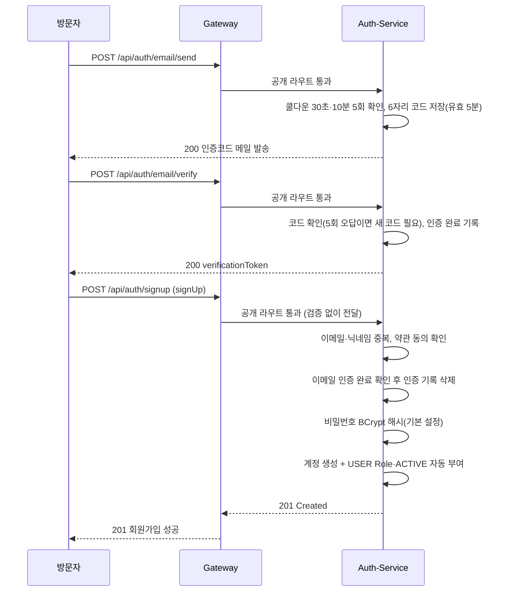

관련 Story: Story 2 · 검증 Test: `UserAuthAcceptanceTest`, `EmailVerificationServiceTest`, `AuthServiceTest`

### Story 2 — 로그인 (login)

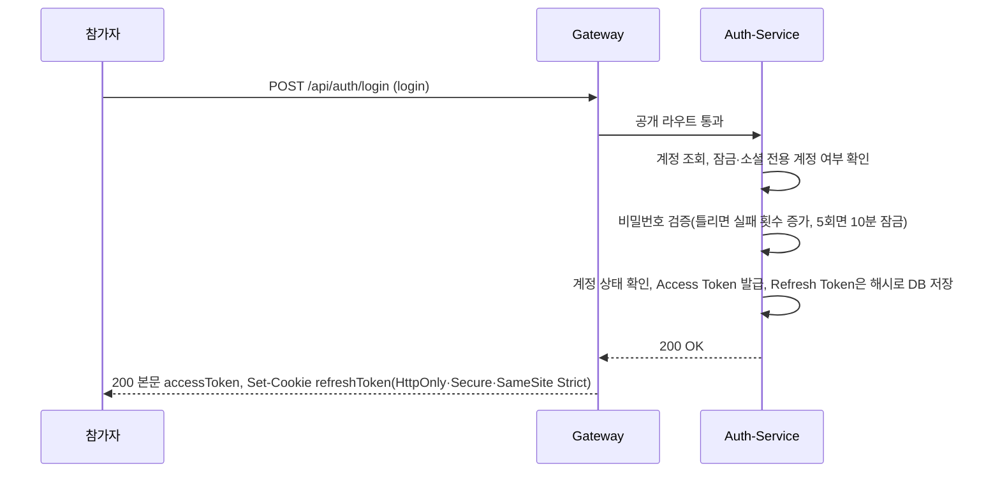

관련 Story: Story 2 · 검증 Test: `UserAuthAcceptanceTest`, `AuthServiceTest`

### Story 2 — Refresh Token 재발급 (reissue)

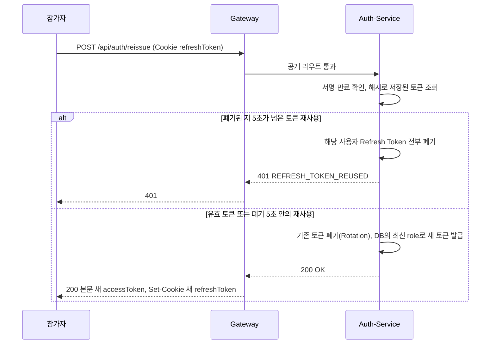

관련 Story: Story 2 · 검증 Test: `UserAuthAcceptanceTest`, `AuthServiceTest`

### Story 3 — 주최 신청 제출·조회 (submitHostApplication / getMyHostApplication)

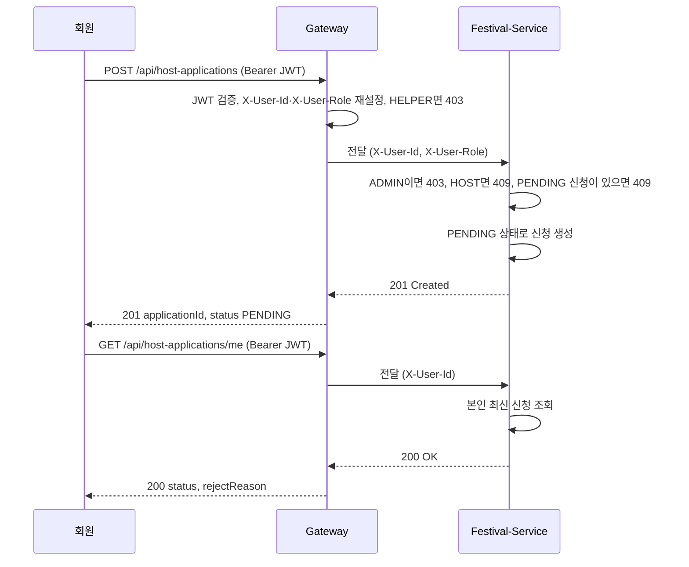

관련 Story: Story 3 · 검증 Test: `HostApplicationAcceptanceTest`, `HostApplicationServiceTest`

### Story 4 — 주최 신청 심사·권한 부여 (reviewHostApplication + grantHostRole)

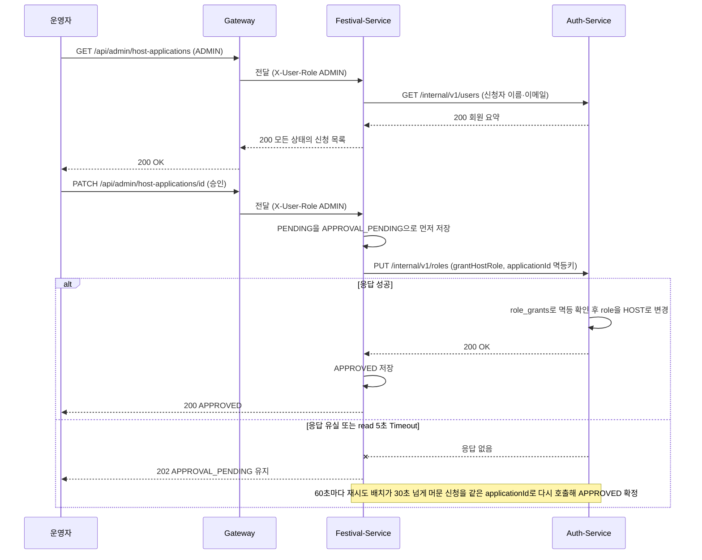

관련 Story: Story 4 · 검증 Test: `HostApplicationReviewAcceptanceTest`, `HostApplicationServiceTest`, `RoleServiceTest`

### Story 5 — 페스티벌 등록·심사·공개 (createFestival / getMyFestivalDetail / reviewFestival)

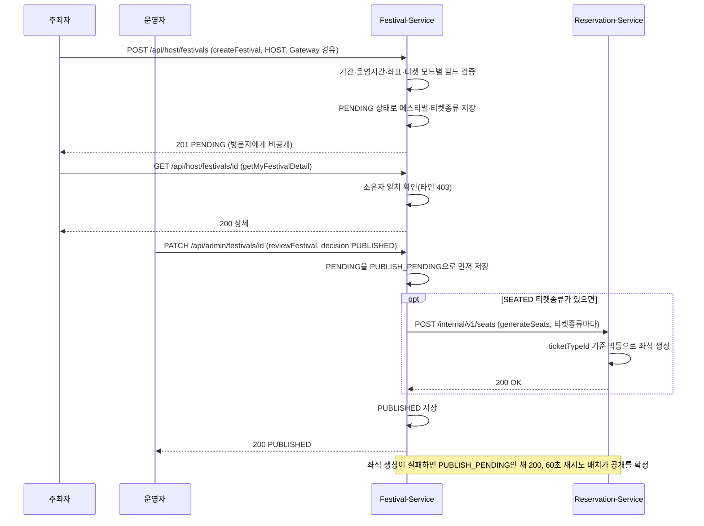

관련 Story: Story 5 · 검증 Test: `HostControllerAcceptanceTest`, `AdminFestivalControllerAcceptanceTest`

### Story 6 — 예매 신청 (createReservation + checkAndDeductStock)

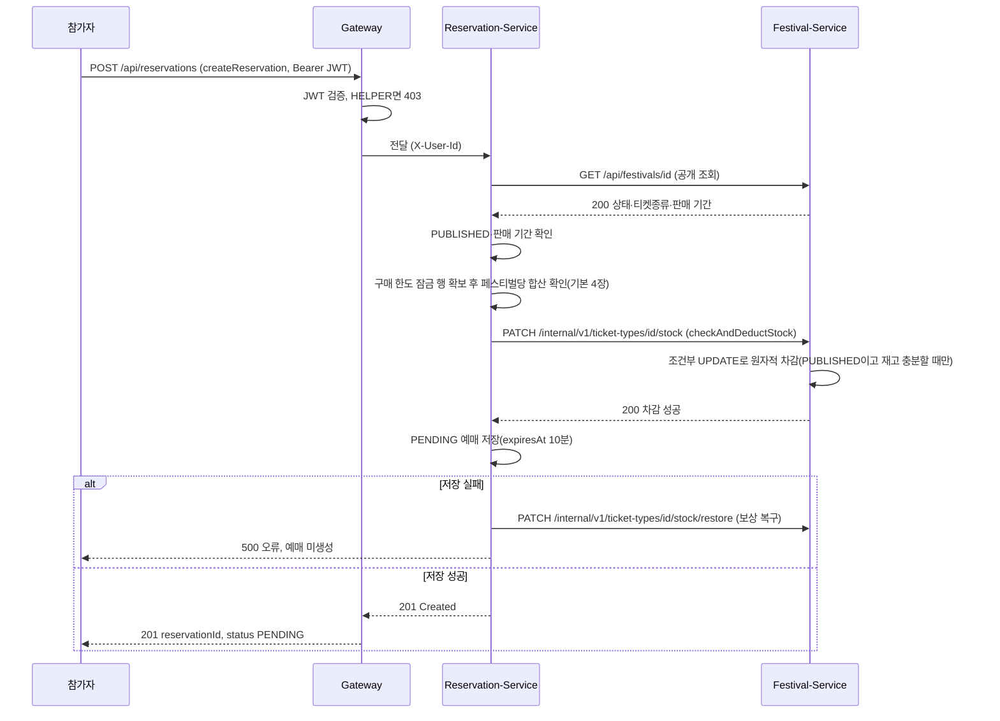

관련 Story: Story 6 · 검증 Test: `ReservationAcceptanceTest`, `PurchaseLimitConcurrencyAcceptanceTest`, `TicketTypeInternalTokenTest`

## 정상 흐름 — Sprint 2 이후 추가 흐름

예매 내역·페스티벌 목록·상세 같은 단순 조회는 한 서비스 안에서 끝나므로 다이어그램을 두지 않습니다(API 문서 참고). 예매 트래픽 대기열은 후속 후보 - 미구현이라 다이어그램이 없습니다(부스 대기열과는 다른 기능).

### 결제 준비·완료·예매 확정과 웹훅 (preparePayment · completePayment · confirmReservation · receiveWebhook)

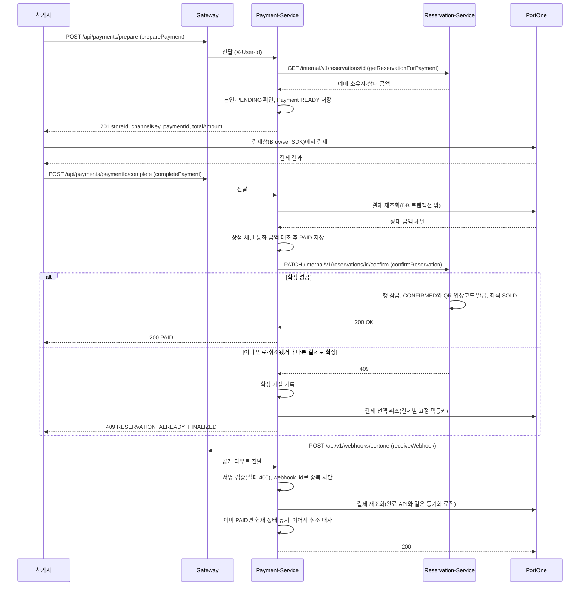

관련 Story: 이 페이지에 번호 없음 — 미확인 - 팀 확인 필요(API 문서는 결제를 Story 7로 표기) · 추가 Sprint: Sprint 2 (2026-09-07 결제 준비·완료·웹훅), 보상 환불은 Week 4 안정화 · 검증 Test: `PaymentAcceptanceTest`, `PaymentServiceTest`, `PaymentCompensationAcceptanceTest`, `WebhookEventServiceTest`, `WebhookControllerTest`

### 환불 — 견적, PG 취소, 예매 반영, 19시 재고·좌석 반환

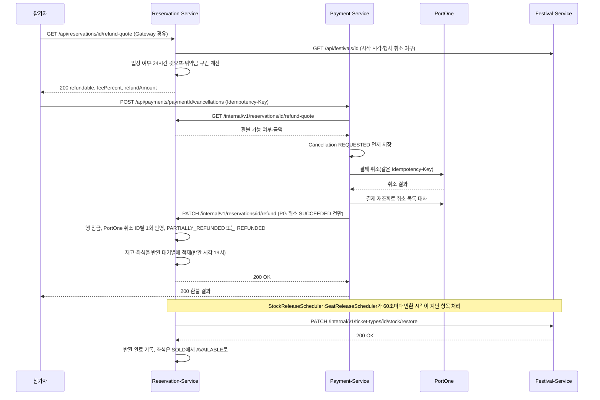

관련 Story: 이 페이지에 번호 없음 — 미확인 - 팀 확인 필요(API 문서는 취소·환불을 Story 9로 표기) · 추가 Sprint: Sprint 2 (2026-09-09 환불), 19시 일괄 반환은 Sprint 3 (2026-09-14) · 검증 Test: `RefundPolicyTest`, `PaymentCancellationServiceTest`, `SeatedRefundAcceptanceTest`, `StockReleaseSchedulerTest`

### 행사 취소 일괄 환불 — 취소 요청·승인, 환불 배치, 취소 완료

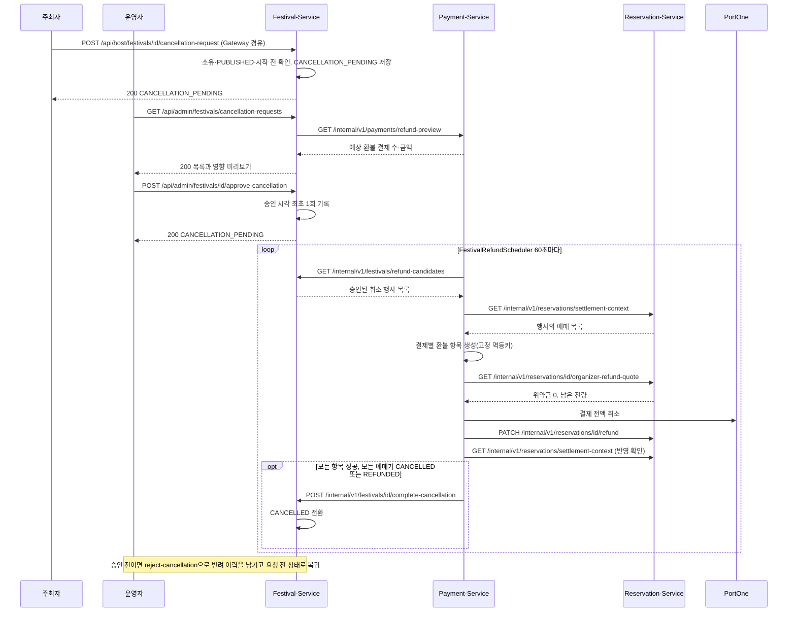

관련 Story: 이 페이지에 번호 없음 — 미확인 - 팀 확인 필요 · 추가 Sprint: Sprint 3 (2026-09-14), 반려는 Week 4 안정화 (2026-09-22) · 검증 Test: `FestivalCancellationAcceptanceTest`, `FestivalRefundSchedulerTest`, `FestivalCancellationRefundAcceptanceTest`, `OrganizerRefundAcceptanceTest`

### 정산 배치 — 후보 조회, 3자 대사, 정산 생성·보류, 관리자 확정 명령

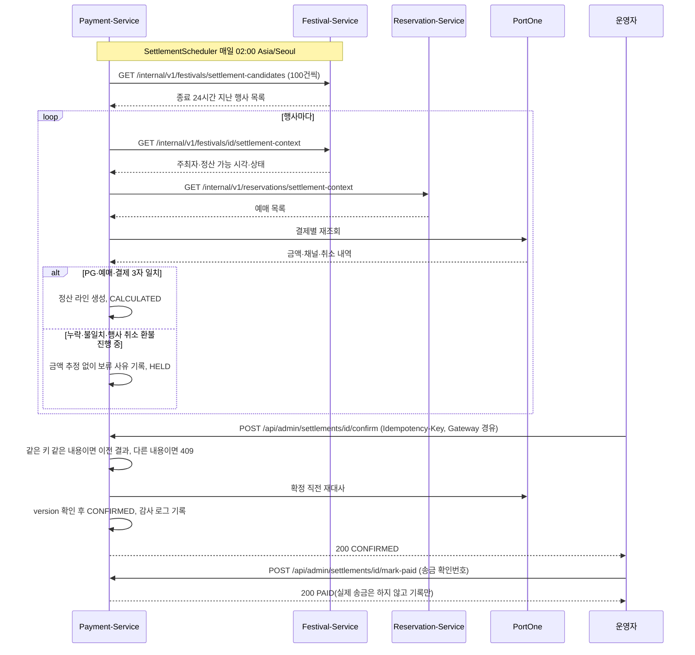

관련 Story: 이 페이지에 번호 없음 — 미확인 - 팀 확인 필요 · 추가 Sprint: Sprint 3 (2026-09-14) · 검증 Test: `SettlementSchedulerTest`, `SettlementAcceptanceTest`, `SettlementCalculatorTest`, `SettlementContractTest`

### 좌석 선점 — 좌석 선택, HELD, STOMP 브로드캐스트, 결제 확정 시 SOLD, 만료 시 원복

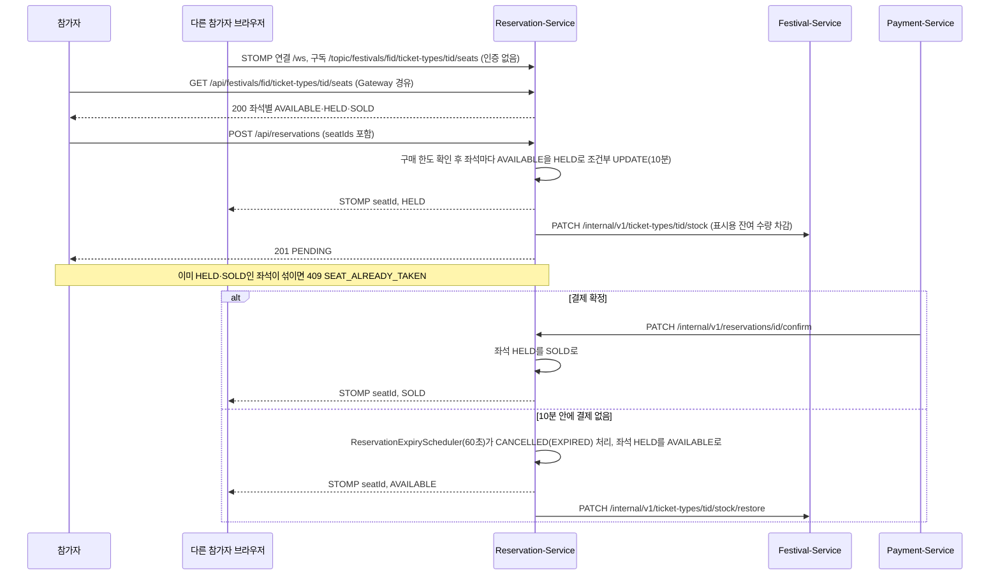

관련 Story: 이 페이지에 번호 없음 — 미확인 - 팀 확인 필요(API 문서는 시나리오 15로 표기) · 추가 Sprint: Sprint 3 (2026-09-14 좌석 생성, 2026-09-16 좌석 생성 내부 API) · 검증 Test: `SeatedReservationStockAcceptanceTest`, `ReservationLockTest` (STOMP 브로드캐스트 전용 테스트는 없음)

## 실패·복구 흐름

| 시작 조건 | 관련 업무 규칙·계약 | 실패 지점 | 안전한 결과 | 재시도·복구 | 관련 Test·Sprint Demo |
| --- | --- | --- | --- | --- | --- |
| 이미 가입된 이메일로 회원가입 시도 | 요구사항 문서 이메일 중복 가입 금지 규칙 · signUp — `POST /api/auth/signup` | Auth-Service 가입 전 이메일·닉네임 중복 검사 | 409(DUPLICATE_USERNAME) 반환, 계정 미생성 | 사용자가 다른 이메일로 재시도(자동 재시도 없음) | `UserAuthAcceptanceTest` · `./gradlew :auth-service:test --tests '*UserAuthAcceptanceTest'` |
| 로그인 시 비밀번호 불일치 | login — `POST /api/auth/login` | Auth-Service 비밀번호 검증 | 401 반환, Token 미발급. 5회 연속 실패하면 10분 잠금(403 ACCOUNT_LOCKED) | 사용자가 비밀번호 재입력, 잠금은 10분 뒤 자동 해제 | `UserAuthAcceptanceTest` · `./gradlew :auth-service:test --tests '*UserAuthAcceptanceTest'` |
| 이미 폐기된(Rotation 완료) Refresh Token으로 재발급 요청 | 요구사항 문서 Refresh Token DB 저장·Rotation 규칙 · reissue — `POST /api/auth/reissue` | Auth-Service Refresh Token 재사용 탐지 | 폐기 5초 안이면 최신 토큰 기준으로 정상 재발급, 5초가 지나면 401(REFRESH_TOKEN_REUSED)과 해당 사용자 전체 Refresh Token 무효화 | 5초 넘은 재사용은 재로그인 필요(자동 복구 없음) | `UserAuthAcceptanceTest` · `./gradlew :auth-service:test --tests '*UserAuthAcceptanceTest'` |
| PENDING 주최 신청이 있는 상태에서 재신청, 또는 이미 HOST Role 보유자·ADMIN이 신청 | 활성 신청 1건만 허용, 기존 주최자 재신청 불가 규칙 · submitHostApplication — `POST /api/host-applications` | Festival-Service 신청 생성 전 검사 | 409(DUPLICATE_APPLICATION·ALREADY_HOST) 또는 ADMIN 403 반환, 신청 미생성 | 기존 신청이 반려된 뒤 재신청 | `HostApplicationAcceptanceTest` · `./gradlew :festival-service:test --tests '*HostApplicationAcceptanceTest'` |
| reviewHostApplication 승인 처리 중 grantHostRole 응답 유실(Timeout) | 승인 처리 멱등성 규칙 · grantHostRole — `PUT /internal/v1/roles`(connect 1초, read 5초) | Festival-Service → Auth-Service 동기 호출 구간 | 신청 상태 APPROVAL_PENDING으로 저장된 채 운영자에게 202, HOST 권한 미확정(APPROVAL_PENDING은 반려 불가) | HostApplicationApprovalRetryScheduler가 60초마다 30초 넘게 머문 신청을 같은 applicationId(멱등키)로 재호출해 중복 부여 없이 APPROVED로 수렴. 운영자가 같은 승인을 다시 보내도 같은 결과 | `HostApplicationReviewAcceptanceTest`, `HostApplicationServiceTest` · `./gradlew :festival-service:test --tests '*HostApplicationReviewAcceptanceTest'` |
| STANDING 티켓 수량 0 이하로 페스티벌 등록 시도 | 티켓 수량은 0보다 커야 등록 규칙 · createFestival — `POST /api/host/festivals` | Festival-Service 등록 전 티켓 모드별 검증 | 400(INVALID_SEAT_LAYOUT) 반환, 페스티벌 미등록 | 주최자가 올바른 수량으로 재요청 | `HostControllerAcceptanceTest` · `./gradlew :festival-service:test --tests '*HostControllerAcceptanceTest'` |
| 남은 재고보다 많은 수량으로 예매 신청, 동시 다발 신청, 또는 티켓 종류를 나눠 한도 우회 시도 | 예매 신청 재고 초과 금지, 동시 요청에도 재고는 실제 수량만큼만 차감 규칙 · createReservation — `POST /api/reservations`, checkAndDeductStock — `PATCH /internal/v1/ticket-types/{id}/stock` | Reservation-Service 구매 한도 잠금 행, Festival-Service 조건부 UPDATE 차감 | 409(STOCK_EXCEEDED·PURCHASE_LIMIT_EXCEEDED) 또는 503(확인 불가) 반환, 예매 미생성, 재고 변화 없음 | 참가자가 남은 수량 확인 후 재시도 | `ReservationAcceptanceTest`, `PurchaseLimitConcurrencyAcceptanceTest` · `./gradlew :reservation-service:test --tests '*PurchaseLimitConcurrencyAcceptanceTest'` |
| 같은 예매를 두 탭에서 결제했거나 결제 도중 예매가 만료된 뒤 결제 승인(이중 결제) | completePayment — `POST /api/payments/{paymentId}/complete`, confirmReservation — `PATCH /internal/v1/reservations/{id}/confirm` | Reservation-Service 예매 확정(409 거절) | 두 번째 결제에 확정 거절 기록, 사용자에게 409(RESERVATION_ALREADY_FINALIZED), 티켓 미발급, 정산·행사 취소 환불에서 제외 | 결제별 고정 멱등키로 자동 전액 환불(보상), 실패하면 PaymentCompensationScheduler가 60초마다 같은 키로 재시도 | `PaymentCompensationAcceptanceTest`, `PaymentCompensationSchedulerTest` · `./gradlew :payment-service:test --tests '*PaymentCompensationAcceptanceTest'` |
| 결제 없이 10분이 지난 예매를 만료 처리하는데 페스티벌 서비스 재고 복구 호출 실패 | restoreStock — `PATCH /internal/v1/ticket-types/{id}/stock/restore` | ReservationExpiryScheduler → Festival-Service 복구 호출 | 예매는 CANCELLED(EXPIRED)로 유지, 복구하지 못한 수량은 `stock_release_queue`에 반환 시각 지금으로 기록(재고 유실 없음) | StockReleaseScheduler가 60초마다 재시도, 실패하면 반환 완료 표시를 비워 다음 회차에 다시 시도 | `ExpiryStockRestoreRetryAcceptanceTest`, `StockReleaseSchedulerTest` · `./gradlew :reservation-service:test --tests '*ExpiryStockRestoreRetryAcceptanceTest'` |
| SEATED 페스티벌 공개 승인 중 좌석 생성 호출 실패(응답 없음·설정 누락) | reviewFestival — `PATCH /api/admin/festivals/{id}`, generateSeats — `POST /internal/v1/seats` | Festival-Service → Reservation-Service 좌석 생성 | 페스티벌은 PUBLISH_PENDING으로 저장된 채 방문자에게 비공개, 운영자 응답은 200(PUBLISH_PENDING) | FestivalPublishRetryScheduler가 60초마다 30초 넘게 머문 페스티벌을 다시 시도(좌석 생성은 ticketTypeId 기준 멱등) | 재시도 경로 전용 테스트 없음 — `AdminFestivalControllerAcceptanceTest`는 SEATED 없는 공개만 검증 · `./gradlew :festival-service:test --tests '*AdminFestivalControllerAcceptanceTest'` |
| 웹훅 처리 중 일시 장애(예약 서비스 응답 없음, Timeout, PortOne 미처리) | receiveWebhook — `POST /api/v1/webhooks/portone` | Payment-Service 웹훅 동기화 | PortOne에는 200 응답, 이벤트는 FAILED로 기록(재시도해도 같은 결과인 오류는 IGNORED), 결제 상태는 이전 그대로 | WebhookRetryScheduler가 60초마다 최대 30회 재처리, RECEIVED로 5분 넘게 멈춘 이벤트도 재처리, 같은 웹훅 재전송도 FAILED면 다시 처리 | `WebhookEventServiceTest`, `WebhookRetrySchedulerTest`, `PaymentAcceptanceTest` · `./gradlew :payment-service:test --tests '*WebhookRetrySchedulerTest'` |
| 해지·행사 종료된 도우미 토큰으로 요청, 또는 인증 서비스 세션 확인 실패·3초 Timeout | `GET /internal/v1/helper-accounts/session`, 입장 검증 — `POST /api/organizer/reservations/verify` | Gateway HELPER 세션 확인 | 401로 거부(fail-closed), 입장 처리 안 함. 허용 경로 외 HELPER 요청은 403 | 도우미가 새 초대로 다시 활성화하거나 주최자가 재초대(자동 복구 없음) | `HelperSessionClientTest`, `JwtAuthenticationGlobalFilterTest` · `./gradlew :gateway:test --tests '*HelperSessionClientTest'` |
| 티켓 없는 참가자가 부스 대기 신청, 중복 신청, 또는 대기자 없이 다음 순번 호출 | requestBoothWaitlist — `POST /api/booth-waitlists/{boothId}`, callNext — `POST /api/booth-waitlists/booths/{boothId}/call-next` | Reservation-Service 대기 신청 자격 확인·카운터 조건부 증가 | 403(TICKET_NOT_FOUND), 409(ALREADY_REQUESTED·NO_WAITING_QUEUE) 반환, 번호 미발급·호출 번호 불변(중복 번호 없음) | 조건을 갖춘 뒤 재시도, 부스 서비스 응답 실패는 503으로 거부 | `BoothWaitlistAcceptanceTest`, `BoothWaitlistCounterTest` · `./gradlew :reservation-service:test --tests '*BoothWaitlistAcceptanceTest'` |