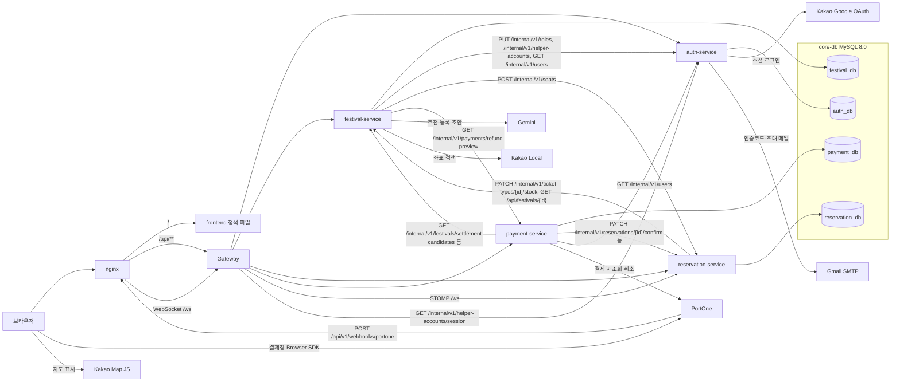

# 아키텍처
<aside>
🏗️

현재 실제로 실행 중인 구조와 결정 기록을 남깁니다. 미래 기술을 완성된 구조처럼 미리 그리지 않습니다.

</aside>

관련 사용자 시나리오: 요구사항 문서 - 3. 사용자 시나리오 · 관련 경계: 서비스 경계 문서 - 후보·확정 경계, 통신 방향·실패

## 현재 실행 구조

| Component | 책임 | 소유 데이터 | 관련 Story·계약 | 상태 | 추가·변경 Sprint |
| --- | --- | --- | --- | --- | --- |
| API Gateway | 클라이언트 진입점 — JWT 검증, X-User-* 헤더 재설정(스푸핑 방지), X-Trace-Id 생성·응답 헤더(각 서비스는 로그 MDC와 내부 호출에 이어 붙임), HELPER 허용 경로 제한과 세션 확인, 경로별 라우팅(/internal/** 라우팅 없음) | 없음 | Sprint 1 전체 Story · GET /internal/v1/helper-accounts/session 호출 | IMPLEMENTED | Sprint 1 |
| 인증·계정 서비스 | 회원가입·로그인(이메일 인증코드, 카카오·구글 소셜), 토큰 재발급, 도우미 계정 발급·초대, 역할 부여, 회원 탈퇴 | 계정(User), RefreshToken, EmailVerification, RoleGrant, 소셜 연동, 도우미 초대(HelperInvitation) | Story2 #8 (계정발급·회원가입·로그인) · PUT /internal/v1/roles | IMPLEMENTED | Sprint 1 |
| 페스티벌 서비스 | 페스티벌 등록·조회·심사, 주최 신청 처리, 티켓 재고 관리, 공개 승인 시 SEATED 좌석 생성 요청, 부스 개설·관리, 행사 취소 신청·승인·반려, AI 추천 챗봇·등록 초안, 조회수 집계, 좌표 백필 | 페스티벌, 티켓종류, 페스티벌 이미지, 부스, 주최신청, 조회 기록, 행사 취소 반려 이력 | Story #9, #10, #22, #26 · PATCH /internal/v1/ticket-types/{id}/stock | IMPLEMENTED | Sprint 1 |
| 예약(Reservation) 서비스 | 티켓 예매 신청(Pending)·만료·취소·환불 견적·환불 반영, 1인 구매 한도, QR 발급·현장 입장 검증, SEATED 좌석 선점·실시간 반영(WebSocket), 환불 재고·좌석 19시 일괄 반환, 부스 대기열. 페스티벌 서비스 API로 재고 확인·차감 | 예약(Reservation), 구매 한도 잠금 행, 환불 반영 기록, 재고·좌석 반환 대기열, 좌석·예약좌석, 부스 대기 신청·카운터 | Story #30 · POST /internal/v1/seats, /internal/v1/reservations/** | IMPLEMENTED | Sprint 1 |
| 결제·정산 서비스 | PortOne 결제 준비·완료 확인·웹훅, 웹훅 미수신 결제 재조회 배치, 결제 취소(환불)와 PG 대사, 이중 결제 보상 환불, 정산(계산·보류·확정·지급 기록·조정), 행사 취소 일괄 환불 배치 | 결제·결제 트랜잭션·웹훅 이벤트·취소, 정산·정산 라인·정산 조정·감사 로그, 환불 배치 기록 | 시나리오 7, 9, 11 · POST /api/v1/webhooks/portone, GET /internal/v1/payments/refund-preview | IMPLEMENTED | Sprint 2~3 |
| 외부 연동: Google Gemini API | AI 페스티벌 추천 응답·등록 초안 생성(generateContent REST 호출, SDK 미사용) | 없음(대화 미저장) | 시나리오 14 | IMPLEMENTED | Week 4 안정화 |
| 외부 연동: PortOne V2(결제 PG, 교육용 테스트 채널) | 결제창(Browser SDK) 결제, 서버 재조회로 최종 검증, 웹훅 수신(서명 검증), 결제 취소 API | 없음 | 시나리오 7, 9 | IMPLEMENTED | Sprint 3 |
| 외부 연동: Kakao·Google OAuth, Kakao Local·Kakao Map, Gmail SMTP | 소셜 로그인(auth-service가 토큰 교환·사용자 정보 조회), 페스티벌 좌표 키워드 검색(festival-service), 브라우저 지도 표시(Kakao Map JavaScript SDK), 이메일 인증코드·도우미 초대 메일 발송(auth-service) | 없음 | 시나리오 1, 2 | IMPLEMENTED | Sprint 2 (OAuth), Week 4 안정화 (Kakao Local) |
| 프론트엔드 (React SPA, CSR) | 브라우저에서 전부 렌더링하는 순수 CSR(SSR 아님). Vite 빌드 산출물을 nginx 컨테이너가 정적 서빙(gzip, /assets는 해시 파일이라 1년 immutable 캐시, index.html·sw.js는 no-cache). 클라이언트 SWR 캐시(10초)·스켈레톤·이미지 페이드인, 서비스워커는 PWA 설치 조건용(캐싱 없음) | 없음(액세스 토큰은 localStorage, 모바일 결제 복귀 정보는 sessionStorage, 부스 알림 확인 기록은 localStorage) | 전 시나리오 | IMPLEMENTED | Sprint 1~Week 4 안정화 |
| 엣지 nginx (TLS·리버스 프록시) | HTTPS 종료(Let's Encrypt/certbot), HTTP→HTTPS 리다이렉트, HTTP/2, `/`는 frontend 컨테이너로, `/api/`는 gateway로 프록시(이미지 업로드용 35MB, 타임아웃 90초, API JSON gzip), `/ws`는 WebSocket 업그레이드 프록시. 업로드 이미지(/api/festivals/images/, /api/booths/images/)는 festival-service 이미지 폴더를 읽기 전용으로 연결해 nginx가 직접 제공(7일 캐시). 초대 링크는 로그에 마스킹 | 없음 | - | IMPLEMENTED | Sprint 3 (Week 4 안정화에 HTTP/2·API 압축·이미지 직접 제공 추가) |
| core-db (MySQL 8.0 단일 인스턴스) | 서비스별 스키마 분리 — auth_db·festival_db·reservation_db·payment_db 4개. 서버 메모리 제약에 맞춰 buffer pool 64MB·max-connections 60으로 조정(docker-compose.small.yml) | 각 서비스 스키마 | - | IMPLEMENTED | Sprint 1~3 |
| CI/CD (GitHub Actions → GHCR → SSH 배포) | main·deploy 푸시와 PR에서 프론트(test·lint·build)·백엔드 빌드/테스트 실행. deploy 브랜치 푸시에서만 이미지를 러너에서 빌드해 GHCR에 올리고, CI가 성공하면 서버에서 git pull → 이미지 pull → docker compose up -d → nginx 설정 재적용(SIGHUP) → 미사용 이미지·빌드 캐시 prune | 없음 | - | IMPLEMENTED | Sprint 3 |

## 결정 기록

| 결정 | 근거가 된 사용자 시나리오·위험 | 선택 | 검토 대안 | 결정 Sprint |
| --- | --- | --- | --- | --- |
| Sprint 1 Vertical Slice를 가입→행사등록→조회→예약신청으로 한정 | 요구사항 문서 "3. 사용자 시나리오" 현재 Release 1~3행 | 결제·QR발급·취소환불은 후속 Sprint로 연기 | 결제까지 포함해 한 번에 구현 — 검증 범위가 너무 넓어져 품질이 떨어질 수 있어 기각 | Sprint 1 |
| 기술 스택 확정: Frontend React(Vite)+Tailwind CSS(관리자 화면 포함 전부 React, jQuery는 쓰지 않음), Backend Spring Boot 3.5 + JPA 단일(MyBatis 미사용), DevOps GitHub Actions(CI/CD)+Docker Compose(Jenkins는 도입하지 않음) | 팀 학습 부담 절감 필요성 (조원 논의) | JPA 단일을 기본으로 하고, 복잡한 집계·리포트 쿼리는 JPA Native Query로 대체 | 자료 원안은 JPA+MyBatis 병행이었으나, 학습 부담을 이유로 기각 — 자료 준수 방침에서 의도적으로 벗어난 사례로 기록 | Sprint 1 |
| 예약(Reservation)을 페스티벌과 분리된 별도 서비스·DB로 운영 | 예약 신청 순간 트래픽이 몰릴 수 있다고 가정(팀 논의) | 예약을 별도 서비스·DB로 분리해, 예약 폭주가 페스티벌 조회에 영향을 주지 않도록 격리 | 처음에는 festival-service 안에 통합 예정이었으나, 트래픽 격리 필요성으로 분리로 변경 | Sprint 1 |
| 대기열(Waiting Queue) 기능을 백로그에 추가, Sprint 2에서 상세화 | 예매 신청 트래픽 몰림 가능성(팀 논의) | Sprint 1에는 포함하지 않고 Sprint 2로 배치, 담당 서비스는 다음 단계에서 결정. 이후 구현되지 않았다 — 예매 트래픽 대기열 코드 없음(부스 대기열과는 다른 기능) | Sprint 1에 포함하는 안도 검토했으나, 이미 통합 Test까지 계획된 Sprint 1 범위가 커져 기각 | Sprint 1 결정 · 미구현, 후속 후보 |
| hibernate.ddl-auto는 지금은 `update`로 운영, 서버에 올려 테스트를 시작하는 시점부터 Flyway `validate`로 전환 예정 | auth/festival/reservation-db에 마이그레이션 도구가 없어 엔티티를 만들 때마다 수동 SQL이 필요했던 문제 (팀 논의) | 지금은 각자 로컬에서만 개발 중이라 `update`로 빠르게 개발하고, 여러 명이 같은 DB를 공유하는 서버 테스트 단계에서만 Flyway로 전환하기로 함. ⚠️ 2026-09-28 main 기준 배포 환경까지 4개 서비스 모두 `update`를 유지하고 있고 Flyway·Liquibase 의존성과 Migration 파일이 없다 — Flyway 전환은 실행되지 않았다(알려진 한계 참고) | 바로 Flyway 도입 — 설치까지 해봤으나, 혼자 로컬에서 개발하는 지금 단계에는 과한 설정이라고 판단해 보류 | Sprint 1 · 전환 미실행(ddl-auto: update 유지) |
| auth·festival·reservation DB를 물리적으로 다시 하나의 MySQL 인스턴스(`core-db`)로 통합, 서비스별로는 스키마만 분리 | 서버를 물리적으로 1대에만 배포하기로 해 DB 프로세스만 따로 놓아둘 트래픽 격리 이점이 사라졌고, Oracle 무료 티어 메모리 제약(인스턴스 3개 → 약 1.1GB, 1개 → 약 400MB)이 더 크게 작용함 (조장 확인) | 서비스별 DB를 모두 하나의 인스턴스(`core-db`)로 통합, `auth_db`·`festival_db`·`reservation_db`·`payment_db` 4개 스키마로만 구분(payment-service 추가로 3개에서 4개가 됨). 서비스(코드·배포 단위) 자체는 여전히 분리 유지 — DB 프로세스만 공유 | 기존 결정(예약을 별도 DB로 분리)를 그대로 유지 — 이미 물리적 서버 분리를 포기한 상황에서는 DB만 따로 놓아둘 트래픽 격리 이점이 없고 메모리만 낭비되어 기각. 또한 자료 원안("각 서비스는 하나의 DB 인스턴스, 그 안에 서비스별 스키마")과도 일치해 채택 | Sprint 1 |
| 실시간 좌석 상태 반영에 WebSocket(STOMP) 채택, 인증 없이 공개 구독 | 좌석 지정형 예매에서 다른 참가자의 선점이 즉시 반영되지 않으면 중복 선택이 빈번하게 발생함(팀 논의) | reservation-service에 STOMP 엔드포인트(`/ws`) 운영, 좌석 조회 자체가 비로그인 공개 정책이라 WebSocket도 동일하게 인증 없이 구독 허용 | 초당 재조회(폴링) 방식도 검토했으나, 동시 접속자가 늘어날수록 폴링 트래픽이 급격히 늘어나 기각 | Sprint 3 |
| (해결됨) SEATED 페스티벌을 승인해도 PUBLISH_PENDING에서 PUBLISHED로 넘어가지 않던 문제 — 원인이 두 번 있었다. 관련: 트러블슈팅 문서 | 1차: reservation-service에 좌석 생성 내부 API(POST /internal/v1/seats) 컨트롤러가 없어 호출이 항상 실패(InternalSeatController 추가로 해결). 2차(2026-09-18, 운영 서버): festival-service에 RESERVATION_SERVICE_URL이 없어 코드 기본값 `localhost:8083`으로 폴백 → 컨테이너 안에서 자기 자신을 가리켜 ConnectException으로 매 재시도마다 영구 실패(로그: ResourceAccessException, Caused by ConnectException). 요청·응답 계약과 재시도 로직은 정상이었고(재현 테스트로 확인) 배포 설정 누락이 원인 | 서비스 간 URL은 docker-compose.yml의 environment로 컨테이너 DNS 이름(`http://reservation-service:8083`)을 명시해 .env의 로컬 개발용 `localhost` 값을 덮어쓴다(같은 키는 environment가 env_file보다 우선). .env.example에도 RESERVATION_SERVICE_URL·INTERNAL_RESERVATION_TOKEN 항목과 설명을 추가 | festival-service의 depends_on에 reservation-service 추가 — reservation-service가 이미 festival-service에 depends_on을 걸고 있어 순환 의존으로 배포 자체가 실패하므로 기각. 기동 순서 문제는 60초 재시도 스케줄러가 흡수 | Week 4 안정화 (해결됨) |
| 페스티벌마다 무대 배치(FestivalStageLayout: FRONT_STAGE/CENTER_STAGE) 필수 입력으로 도입 | SEATED 티켓의 구역을 화면에 어떻게 배치할지(그리드 vs 도넛형)가 무대 위치에 따라 달라짐(팀 논의) | 모든 페스티벌에 stage_layout을 필수로 받고, TicketType은 이에 따라 position_row·position_col(FRONT_STAGE) 또는 position_angle(CENTER_STAGE) 중 하나만 채운다 | SEATED 티켓이 있는 페스티벌에만 선택적으로 받는 안도 검토했으나, STANDING만 있는 페스티벌도 후속으로 SEATED를 추가할 수 있어 처음부터 필수로 통일 | Week 4 안정화 |
| 부스 대기 호출 알림은 WebSocket 대신 15초 폴링 채택 | 챗봇 위젯이 로그인 상태에서 내 대기 현황을 주기적으로 확인해 "내 차례"가 되면 알림해야 함(사용자 요청) | GET /api/booth-waitlists/me/active를 15초마다 폴링(마이페이지 예약 탭 자동갱신과 같은 주기)해 알림을 보여준다 | 좌석처럼 WebSocket(STOMP) 즉시 push도 검토했으나, 대기 호출은 초 단위로 급하게 바뀔 필요가 없고 구현이 훨씬 간단해 폴링으로 결정 | Week 4 안정화 |
| 챗봇 FAB를 스피드다이얼로 분리(추천 챗봇 / 부스 알림) (PR #288) | 추천 대화와 부스 호출 알림이 한 대화창에 섞여 구분이 안 됨(사용자 요청) | 우하단 버튼 1개를 누르면 "추천 챗봇"·"부스 알림" 미니 버튼(아이콘+라벨, 모바일에서 작게)이 펼쳐지고 각자 전용 패널을 연다. 데이터도 chatMessages와 boothAlerts로 분리하고, 알림 패널은 입력창 없는 알림 피드 전용 | 신청한 모든 부스의 대기번호·호출번호를 보여주는 실시간 "내 대기 현황" 패널도 검토했으나, 알림 피드만으로 충분하다고 보아 보류 | Week 4 안정화 |
| 부스 알림의 "이미 확인함" 기록을 브라우저(localStorage, 계정별)에 저장 (PR #291) | 백엔드는 호출된 대기 항목을 myTurn=true로 영구히 반환하고 확인·만료 개념이 없어, 새로고침할 때마다 같은 알림이 새 알림으로 보여 안 읽음 배지가 반복됨. 부스 목록 모달도 다시 열면 이미 받은 대기번호를 잊고 "대기 신청" 버튼부터 보여줌 | 알림 패널을 열어 확인한 boothId를 localStorage(fevalgo:notified-booth-alerts:{userId})에 저장해 안 읽음 배지 판단에만 쓰고, 알림 목록 자체는 매 폴링의 서버 응답으로 다시 만들어 새로고침해도 유지한다. 부스 목록 모달은 열 때 내 대기 신청을 부스별로 병렬 조회해 기존 대기번호를 바로 표시 | 백엔드에 acknowledgedAt 컬럼과 확인 API를 추가하면 기기 간에도 공유되지만 스키마 변경이 필요해 보류. 지금은 다른 기기·브라우저에서는 안 읽음 배지가 다시 뜨는 한계가 있다 | Week 4 안정화 |
| 프론트 정적 자산에 gzip 압축·장기 캐시 헤더 적용 (PR #289) | nginx에 gzip·Cache-Control이 없어 700KB대 JS 번들이 무압축으로 나가고, 재방문마다 origin에 재검증 요청이 감(서버 1대·메모리 제약 환경) | frontend nginx.conf에 gzip 활성화, /assets/(빌드 해시 파일)는 max-age 1년 immutable, brand·이미지·webmanifest·폰트는 7일, index.html·sw.js는 no-cache(배포 직후 최신 해시 자산 참조·서비스워커 갱신 보장) | CDN 도입, 서비스워커 캐싱은 미도입(sw.js는 PWA 설치 조건용 no-op 유지 — API 캐싱이 인증 흐름과 충돌할 수 있어 정적 자산에 한정해 추후 검토) | Week 4 안정화 |
| 클라이언트 SWR 캐시 + 스켈레톤·이미지 페이드인 + 클릭 직전 프리페치 (PR #298) | 페이지마다 useEffect로 같은 목록·상세를 매번 다시 요청하고, 로딩 표시가 "불러오는 중…" 텍스트뿐이라 체감이 느림 | queryCache(useCachedQuery)로 목록·상세 GET을 10초간 신선 캐시하고 이후엔 캐시를 먼저 그린 뒤 뒤에서 재검증(같은 key 진행 중 요청은 합치고, 실패는 캐시하지 않으며, 최대 60개 보관). 예매 생성·취소가 성공하면 페스티벌 캐시를 비워 잔여 수량이 낡은 값으로 보이지 않게 함. 카드 pointerdown 시 상세를 프리페치. 스켈레톤(홈·목록·상세)과 FadeImage(lazy·페이드인, 캐시된 이미지는 즉시 표시) | hover 프리페치는 상세 GET이 조회수를 집계(IP당 24시간 1회)해 인기순이 왜곡되므로 기각. 홈·목록 size=100 축소는 마감임박·카테고리를 클라이언트에서 거르고 서버 필터가 없어 항목이 누락되므로 기각. TanStack Query는 필요한 기능이 작아 도입하지 않고 직접 구현 | Week 4 안정화 |
| Refresh Token Rotation + 재사용 탐지에 5초 유예 구간 | 새로고침을 짧은 시간에 여러 번 하면 이전 재발급 응답이 반영되기 전에 이미 폐기된 refreshToken으로 다시 재발급을 시도해, 탈취로 오판되어 전체 로그아웃됨(시나리오 2) | Refresh Token은 SHA-256 해시로만 저장하고 재발급마다 교체(revoked_at·replaced_by_token_id 기록). 폐기 후 5초(REUSE_GRACE_PERIOD) 안의 재사용은 replaced_by_token_id 체인을 따라 최신 유효 토큰 기준으로 정상 교체하고, 5초를 넘긴 재사용은 해당 사용자의 모든 토큰을 폐기한 뒤 401(REFRESH_TOKEN_REUSED) | 폐기된 토큰 재사용을 무조건 탈취로 간주해 전체 로그아웃(변경 전 동작) — 새로고침 경합에서 정상 사용자가 로그아웃되어 변경 | Sprint 2 |
| 서비스 간 호출 실패는 "중간 상태 먼저 커밋 + 멱등 키 + 재시도 배치"로 복구 | 운영 서버에서 주최자 Role 부여 응답이 read timeout(2초)을 넘겨 신청이 APPROVAL_PENDING에 멈춤(신청 #6, Role은 실제로 부여됨). 좌석 생성 호출 실패 시 페스티벌 공개가 멈출 위험(시나리오 4, 15) | 주최 승인은 APPROVAL_PENDING, 페스티벌 공개는 PUBLISH_PENDING을 먼저 저장한 뒤 외부 호출. 멱등 키는 applicationId(PUT /internal/v1/roles)와 ticketTypeId(POST /internal/v1/seats). HostApplicationApprovalRetryScheduler·FestivalPublishRetryScheduler가 60초마다 30초 이상 머문 건을 재시도. auth 호출 read timeout을 5초로 상향 | 기록 없음 | Sprint 1 (중간 상태, 2026-09-03) · Sprint 2 (재시도 배치, 2026-09-13·09-14) |
| 1인 구매 한도 검사는 (사용자, 페스티벌) 잠금 행으로 직렬화 | 같은 사용자의 동시 예매가 둘 다 "아직 산 게 없음"으로 읽혀 한도를 넘을 수 있음. 티켓 종류를 나눠 사면 한도를 우회할 수 있었음(QA, 시나리오 6) | purchase_limit_locks 행(unique user_id·festival_id)을 INSERT 후 SELECT … FOR UPDATE로 잠그고, 합산은 잠금 없이 PENDING·CONFIRMED·PARTIALLY_REFUNDED의 남은 장수를 페스티벌 단위로 더한다. 예매 생성 트랜잭션은 READ COMMITTED, reservations에 (user_id, festival_id) 인덱스 | 예매 테이블을 합산 시 FOR UPDATE로 잠그는 방식 — 인덱스가 없어 전체 행·빈 구간이 잠겨 다른 사용자 예매가 줄을 서고, 인덱스를 추가해도 빈 구간 잠금으로 교착이 재현되어 폐기 | Week 4 안정화 |
| 환불된 재고·좌석은 즉시 풀지 않고 매일 19시에 일괄 반환 | 환불 직후 같은 재고를 바로 다시 사는 리셀을 막는 팀 정책(시나리오 9) | 환불 수량은 stock_release_queue, 환불 좌석은 seat_release_queue에 모아 두고 StockReleaseScheduler·SeatReleaseScheduler(60초 주기)가 반환 시각(기본 19시, REFUND_STOCK_RELEASE_HOUR)이 지난 항목을 반환. 반환 호출이 실패하면 released_at을 비워 다음 회차에 재시도. 결제 전 만료된 예매의 재고는 즉시 복구하고, 복구 호출이 실패한 경우에만 반환 시각을 '지금'으로 해 같은 대기열로 재시도(19시를 기다리지 않음) | 기록 없음 | Sprint 2·3 경계 (2026-09-14) |
| 결제 결과는 항상 PortOne 서버 재조회로 검증 | 브라우저가 보낸 결제 결과·웹훅 본문의 금액은 변조될 수 있음(시나리오 7) | 완료 API(POST /api/payments/{paymentId}/complete)와 웹훅이 같은 동기화 로직을 공유하고, PortOne 조회 결과의 상점·채널·테스트 채널 여부·통화·금액을 우리 주문과 대조해 하나라도 다르면 거절(PAYMENT_VERIFICATION_FAILED). PortOne 조회 중에는 DB 트랜잭션을 열지 않음 | 프론트 결제 결과·웹훅 본문을 그대로 신뢰 — 코드 주석에서 신뢰하지 않는다고 명시 | Sprint 1·2 경계 (2026-09-07) |
| 이중 결제·만료 후 결제는 자동 전액 환불(보상) | 같은 예매를 두 탭에서 결제하거나 결제 도중 예매가 만료되면, 결제는 승인됐는데 티켓을 줄 수 없음(시나리오 7) | 예매 확정이 409로 거절되면 결제에 거절 시각을 남기고 결제별 고정 멱등키로 전액 취소. 실패하면 PaymentCompensationScheduler(60초)가 재시도하고, 거절된 결제는 정산·행사 취소 일괄 환불에서 제외 | 기록 없음 | Week 4 안정화 |
| 웹훅이 오지 않은 결제는 배치가 PortOne에 다시 조회 | 브라우저가 완료 API를 부르기 전에 닫히고 웹훅까지 유실되면 PG에서는 승인됐는데 우리 DB는 READY로 남음. 웹훅 재시도 배치는 받은 웹훅만 다시 처리함(시나리오 7) | PaymentSyncScheduler가 5분마다 생성 후 10분~24시간의 결과 미정 결제와 확정 응답을 못 받은 결제를 최대 100건씩 완료 API·웹훅과 같은 syncPayment로 다시 동기화. 결제창이 열려 있을 수 있는 10분은 비켜 둠 | 결과 미정 결제를 EXPIRED로 바로 닫는 안 — 늦게 승인된 결제가 EXPIRED에서 PAID로 전이하지 못해 보상 환불 경로를 막으므로 기각 | Week 4 안정화 (2026-09-29, PR #357) |
| X-Trace-Id를 서비스 로그와 서비스 간 호출까지 전달 | 과정 공통 완료 기준 "동기 호출의 Trace ID 전달". Gateway는 값을 만들기만 하고 서비스는 읽지 않아 한 요청의 로그를 서비스 간에 묶을 수 없었음 | 서비스별 TraceIdFilter가 값을 로그 MDC(`traceId`)에 싣고(형식이 다르면 새로 생성), 서비스 간 RestClient에만 TraceIdPropagationInterceptor를 등록. 응답 헤더는 Gateway만 붙임 | 분산 추적 도구(Micrometer Tracing·Zipkin) 도입 — 1GB 서버에 수집 서버를 더 띄울 여유가 없어 헤더 전달과 로그 패턴으로 한정. 서비스도 응답 헤더를 붙이는 안은 응답에 같은 헤더가 두 번 실려 기각 | Week 4 안정화 (2026-09-29, PR #359) |
| 비밀값이 기본값이면 운영형 기동을 실패시킴 | JWT_SECRET·INTERNAL_*_TOKEN·PORTONE 비밀값이 빠지면 저장소에 공개된 기본값으로 기동해 토큰 위조·내부 API 호출이 가능해짐 | 서비스별 RequiredSecretsValidator. `REQUIRE_CONFIGURED_SECRETS=true`(docker-compose.yml 기본)면 기본값·빈 값일 때 환경변수 이름만 남기고 기동 실패, 로컬·테스트는 경고만 | 코드 기본값을 모두 없애는 안 — 로컬 bootRun·테스트가 환경변수 없이 뜨지 않아 기각 | Week 4 안정화 (2026-09-29, PR #361) |
| 로컬 재현용 compose override를 따로 둠 | 과정 공통 완료 기준 "docker compose 한 번으로 새 환경에서 재현". 운영 compose는 bootJar 선행 빌드·Let's Encrypt 인증서·DB 직접 역할 부여가 필요했음 | `docker-compose.local.yml`  • `backend/Dockerfile.local`(이미지 안에서 bootJar) + `nginx-local/default.conf`(HTTP) + auth-service 로컬 시드 계정(`LOCAL_SEED_ENABLED`). 프로젝트·컨테이너 이름과 포트를 분리 | 운영 Dockerfile을 멀티 스테이지로 바꾸는 안 — CI가 러너에서 만든 jar를 쓰는 운영 빌드 경로를 바꾸게 되어 기각. 시드를 SQL init 스크립트로 넣는 안 — 테이블이 JPA 기동 때 생기고 비밀번호는 BCrypt가 필요해 기각 | Week 4 안정화 (2026-09-29, PR #367) |
| 부스는 공개(PUBLISHED) 페스티벌에만 개설 | 부스 개설이 STOREHOST 역할만 확인해 심사 전·반려·종료·취소된 행사에도 부스가 생김(시나리오 13) | PUBLISHED가 아니면 409(FESTIVAL_NOT_OPEN_FOR_BOOTH), 상세 화면도 개설 버튼 대신 안내. 부스 운영자는 주최자가 아닌 입점 사업자라 소유권은 따지지 않음 | 주최자 승인을 받아야 개설하는 안 — 승인 흐름이 없어 후속 후보 | Week 4 안정화 (2026-09-29, PR #363) |
| 정산 대사가 맞지 않으면 금액을 추정하지 않고 보류(HELD) | PG·예매·결제 기록이 서로 다르면 잘못 지급할 위험(시나리오 11) | SettlementScheduler(매일 02:00)가 세 기록이 모두 맞을 때만 정산 라인을 만들고, 어긋나면 보류 사유를 남겨 HELD로 둔다. 관리자 명령은 Idempotency-Key 필수 + fingerprint 대조 + 감사 로그, 동시 확정은 @Version 충돌 시 409(CONCURRENT_MODIFICATION) | 누락·불일치 금액을 추정해 계산 — 코드 주석에 "잘못 지급하는 것보다 사람이 확인하는 편이 싸다"는 이유로 선택하지 않음 | Sprint 2·3 경계 (2026-09-14) |

## 알려진 한계·기술 부채 (2026-09-29 재점검, main + PR #357·#359·#361·#363·#365·#367)

| 항목 | 내용·영향 | 근거 위치 | 상태 |
| --- | --- | --- | --- |
| 회원 탈퇴 시 예약 보유 정책 미정 | 예매가 남은 회원도 확인 없이 탈퇴 처리된다 | UserService.withdrawAccount ("정책 정해야함" 주석) | 미해결 |
| DB 스키마 자동 갱신(ddl-auto: update), 마이그레이션 도구 없음 | 4개 서비스 모두 배포 환경에서도 update. 엔티티 변경이 그대로 운영 DB에 반영돼 이력·롤백이 없다 | 각 서비스 application.yaml | 미해결 |
| 내부 토큰 환경변수 누락이 기동 시 드러나지 않음 | 비밀값을 빠뜨리면 코드 기본값으로 기동되던 문제. docker-compose.yml로 띄우면 이제 기본값·빈 값일 때 기동이 실패하고 빠진 환경변수 이름이 로그에 남는다. bootRun으로 직접 띄울 때는 경고만 남는다 | 각 서비스 RequiredSecretsValidator, docker-compose.yml `REQUIRE_CONFIGURED_SECRETS` | 해결(PR #361) |
| 공개 목록 API에 서버 필터가 없음 | GET /api/festivals는 페이징·정렬만 받고 카테고리·마감임박 필터가 없어, 홈·전체 목록이 size=100으로 받아 클라이언트에서 거른다. 페스티벌이 늘면 한계가 온다 | FestivalController.listFestivals, Home.jsx·Festivals.jsx | 미해결 |
| 부스 호출 알림의 기기 간 불일치·폴링 | "이미 확인함" 기록이 브라우저에만 있어 다른 기기에서는 안 읽음 배지가 다시 뜬다. 15초 폴링이라 최대 15초 지연 | ChatbotWidget.jsx | 수용(위 결정 기록 참고) |
| 로그인 쿠키 secure 고정 | refresh 쿠키가 항상 Secure라 로컬 http 개발에서는 전송되지 않는다("나중에 고려" 주석) | AuthCookieResponseBuilder | 미해결 |
| 프론트 잔여 임시 요소 | 푸터 고객센터 번호 1588-0000(가짜 번호), 마이페이지 "주최자 소개 문구" 비활성 UI(준비 중), data/festivals.js 목 데이터 배열(미사용 코드), SeatMap의 [WS DEBUG] console.log | SiteFooter, MyPageHostTab, data/festivals.js, SeatMap.jsx | 미해결 |
| 프론트 성능·안정성 | 에러 바운더리가 없어 렌더 예외 시 화면이 하얗게 되고, 라우트 코드 스플리팅이 없어 단일 번들이며, 서비스워커는 캐싱을 하지 않는다 | App.jsx, vite build, public/sw.js | 미해결 |
| 테스트 공백 | 좌석 생성 내부 API와 SEATED 페스티벌 공개 재시도 경로는 PR #365에서 테스트를 추가했다. 운영자 회원 정지(`AdminUserService`), 운영 현황·대시보드 요약(`FestivalOperationService`, `AdminSummaryService`)은 전용 테스트가 없고, 여러 서비스를 함께 띄우는 자동 E2E 테스트는 없다(로컬 재현 스모크는 수동) | `InternalSeatGenerationAcceptanceTest`, `SeatedFestivalPublishRetryTest`, 운영자 서비스 테스트 검색 결과 | 일부 해결 |
| 예매 트랜잭션 안의 서비스 간 호출 | 예매 생성 트랜잭션이 페스티벌 조회·재고 차감 HTTP 호출 동안에도 DB 커넥션을 잡고 있어, 운영 조건(CPU 2개·풀 5)에서 처리 한계가 초당 약 100건이다. 재고 차감 응답이 Timeout이면 차감 여부를 확정할 수 없다. 다음 단계는 행사 조회를 트랜잭션 밖으로 빼기 → 예매 전용 내부 조회 API → 재고 나누기 | `ReservationService.createReservation`, README 부하 테스트 절 | 미해결 |